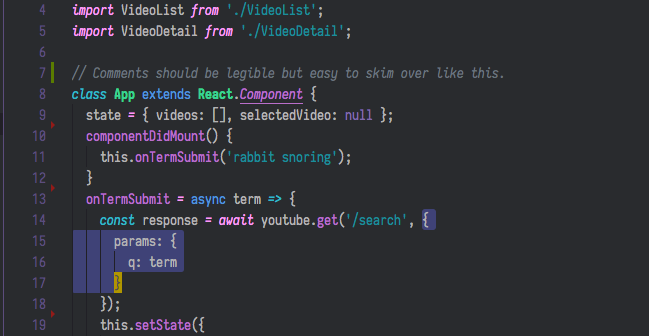

# Jummiterm Themes for VSCode (alpha)

A VSCode syntax and UI theme based on Jummiterm. Jummiterm is a text highlighting scheme for terminals and code which I have developed for [my own dotfiles](https://github.com/jcherven/dotfiles). It is suitable for web development and system administration, designed with the following document types in mind:

- JS/JSX
- JSON
- HTML/CSS
- shell/bash
- vimscript

Work in progress.

## Design Principles

- Limited palette of colors in pastel hues
  - 8 basic cterm colors which are in inverted sorting for their bright variations
  - Use of darkened/lightened shades of basic theme colors to keep the number of unique colors low
  - Use italics instead of a new color where possible
- Just enough contrast; not too much
  - A reaction to maximalist color themes that brightly mark every token possible with a unique divergent color, making the reading choppy. Non-users of the scheme should be able to immediately understand what the highlighting communicates.
- Not every token is a magic word
  - Use of a typical terminal foreground color for text that doesn't need special emphasis. Powerful tokens built in to the language should get more emphasis than user tokens.
- Subtle comments
  - Comments that blend into the background a bit are easy to skim over when you need to focus on the active code content.
- Different parts of your stack should be visually distinct
  - With multiple filetypes being concurrently open in different editor panes and tabs, filetypes should have a distinct visual character to assist your brain in switching between them.

## Current work

- Testing and adjusting token colors in work environments

## To Do

- More thoughtful error and warning highlighting
- Light theme for glossy screens in bright environments
- CSS token highlighting needs considerable refining
- More thoughtful color selection for VSCode GUI elements like borders and file explorer highlighting
